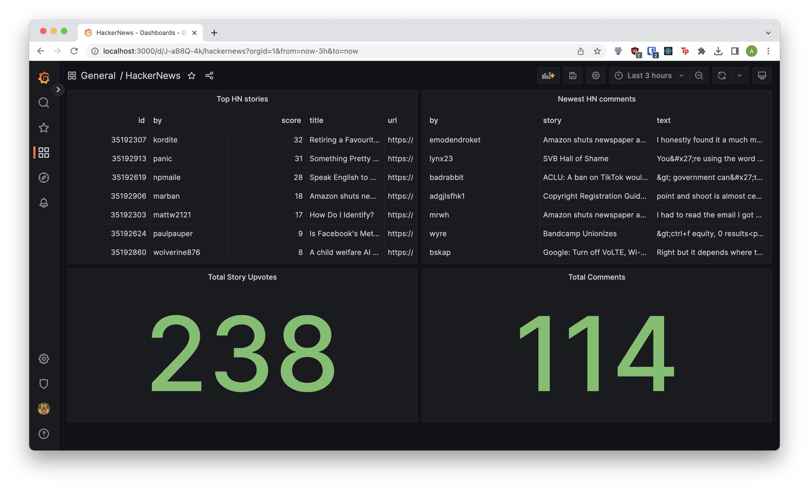

# grafana-clickhouse-jdbc

Consolidate your JDBC data in Clickhouse, and visualize with Grafana.

## Motivations

1. The generic JDBC datasource and some databases like Oracle are only supported in Grafana Enterpise. On the other hand, Clickhouse has an open-source plugin and can speak JDBC to other databases.
2. For expensive JOINs, it makes sense to mirror the data to Clickhouse to take advantage of its analytical capabilities. It makes this easy with `JDBC` tables and `LIVE VIEW`.
For streaming data, Clickhouse also supports materializing Kafka and AMQP topics.

## Components

- [Postgres](https://github.com/postgres/postgres): Holds the raw data. This can be any JDBC-compatible database (and you can have multiple databases).
- [Clickhouse](https://github.com/ClickHouse/ClickHouse): Mirrors the data from Postgres/JDBC and stores the data locally using a `LIVE VIEW` that refreshes every X seconds.
- [Clickhouse JDBC Bridge](https://github.com/ClickHouse/clickhouse-jdbc-bridge): Bridge required for Clickhouse to speak JDBC (includes vendor drivers for Postgres etc.)
- [Grafana](https://github.com/grafana/grafana): Reads data from Clickhouse using the [Clickhouse Datasource Plugin](https://github.com/grafana/clickhouse-datasource), and visualizes using graphs.

See `infra/docker-compose.yaml` for the images and environment variables.

## Example

This repo uses data pulled from Hacker News to demonstrate the stack. Python scripts in `services` will scrape HN and push the data into 2 Postgres tables (`comments` and `stories`).

The sample service does not interact with Clickhouse directly, to demonstrate how the Grafana/Clickhouse combination is entirely separated from the dev stack.

The sample Grafana dashboard (screenshot) does multiple Clickhouse queries, one of which is a `JOIN` between the two materialized views. Can you guess which one?
